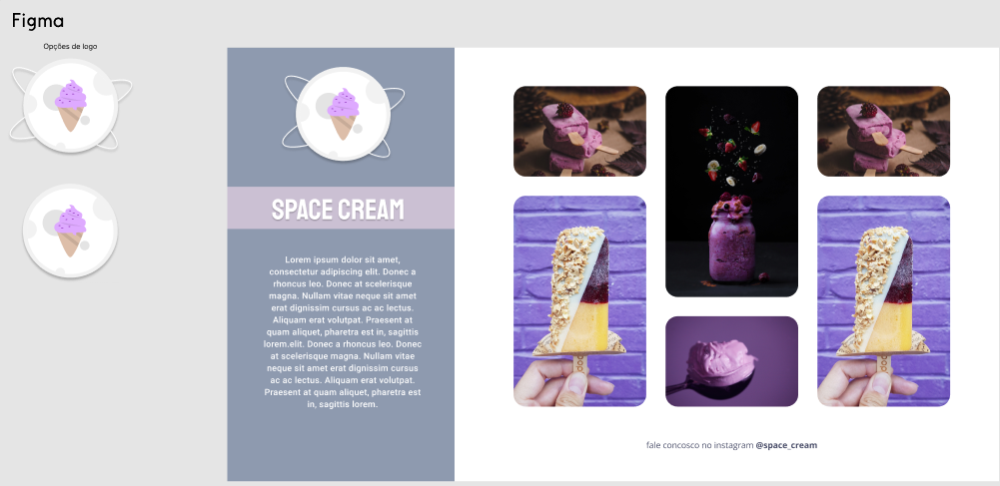

## Space-Cream

<h3 align="center">Learnings</h3>

> 

> - Mobile First;
>  
> - Flexible Unit of Measurement;
>  
> - Variables;
>  
> - Simple Animations.
>  
> - Transitions;
>  
> - Grid;
>  
> - Media queries. 

<h3>Figma</h3>

 

Figma link:	
 	

 
<b>The project was based on this figma project above</b>
 	

<h3 align="center">Mobile First!</h3>

<h3 align="center">Desktop Version!</h3>

## Autor

